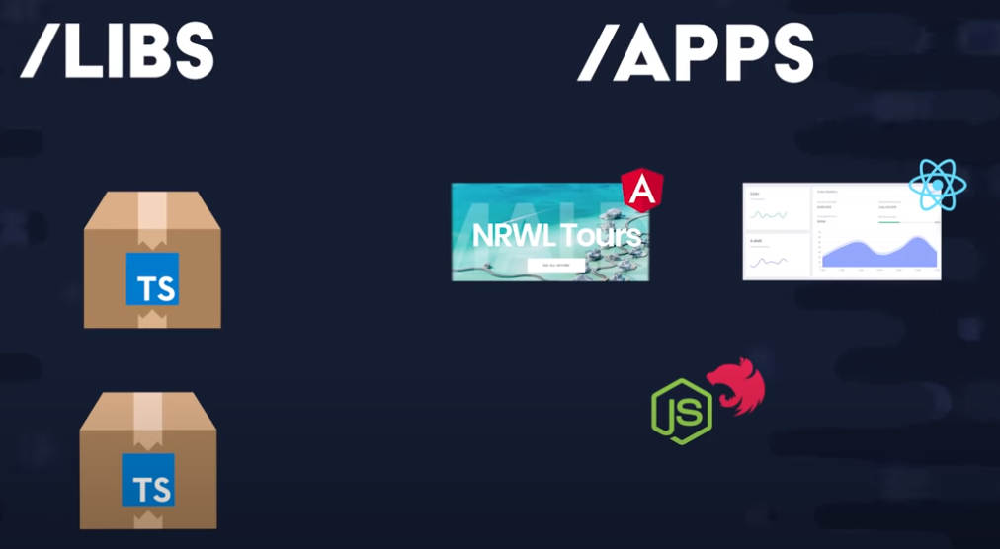

# NX Monorepo

Utilizamos NX para ter um único repositorio git para gerenciar vários aplicativos e bibliotecas.

#### Aulas

- [x] ​	Introduction: Nx Workspaces Course
- [x] ​	Create an empty workspace
- [x] ​	Create an app and a UI library
- [x] ​	Add a server API
-------------------------------------
- [ ] ​	Set up the Board Game Hoard API
- [ ] ​	Review app in React 
- [ ] ​	Split the review site into separate libraries
- [ ] ​	Store app in Angular
- [ ] ​	Share UI with web components
- [ ] ​	Shared assets library and nx.json
- [ ] ​	Nx Cloud Walkthrough


Neste exemplo construiremos um projeto full stack, com duas interfaces front-end uma Angular e outra React e um backend compartilhado, além disso utilizaremos diversas bibliotecas

<p style="text-align: center;"></p>


## Padrão de Commits

```
<Tipos>(<Escopo>): <curta descrição>
  │       │             │
  │       │             └─⫸ Resumo no tempo presente. Não capitalizado. Sem ponto final.
  │       │
  │       └─⫸ Escopo de commit:  Opcional, pode ser qualquer coisa que especifique o escopo da alteração de confirmação.
  |                               Por exemplo $location|$browser|$compile|$rootScope|ngHref|ngClick|ngView, etc.
  |                               No desenvolvimento de aplicativos, o escopo pode ser uma página, um módulo ou um componente.
  │
  └─⫸ Tipos de commit: feat|fix|docs|style|refactor|test|chore|perf|ci|build|temp
```


## Iniciando com o monorepo

instale o nx cli
```
	npm install -g @nrwl/cli
```

Crie um monorepo
```
    npx create-nx-workspace <<nome-monorepo>>
```

Após isso vá para a pasta do repositório criado
```
    cd <<nome-monorepo>>
```


## Criando um APPs React/Express e Librays

- Plugins

React
```
	npm install -D @nrwl/react
```

Express
```
  npm install -D @nrwl/express
```

- agora gere o App react: my-site
> Baixe a extensão NX Generate > application @nrlw/react

- gere também uma lib: iu-header
> Library @nrlw/react

- cria agora um componente para sua lib: page-title *DENTRO DO iu-header*
> Component @nrlw/react

- cria agora um componente para o --frontendProject=my-site: api *DENTRO DO iu-header*
> Component @nrlw/react
