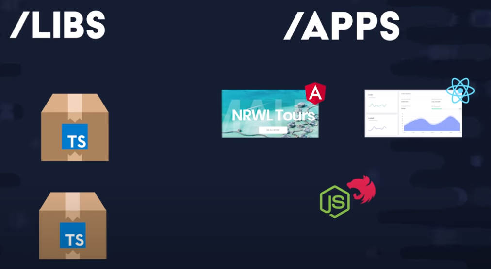

# NX Monorepo

Utilizamos NX para ter um único repositorio git para gerenciar vários aplicativos e bibliotecas

Neste exemplo construiremos um projeto full stack, com duas interfaces front-end uma Angular e outra React e um backend compartilhado, além disso utilizaremos diversas bibliotecas

<p style="text-align: center;"></p>


## Padrão de Commits

```
<Tipos>(<Escopo>): <curta descrição>
  │       │             │
  │       │             └─⫸ Resumo no tempo presente. Não capitalizado. Sem ponto final.
  │       │
  │       └─⫸ Escopo de commit:  Opcional, pode ser qualquer coisa que especifique o escopo da alteração de confirmação.
  |                               Por exemplo $location|$browser|$compile|$rootScope|ngHref|ngClick|ngView, etc.
  |                               No desenvolvimento de aplicativos, o escopo pode ser uma página, um módulo ou um componente.
  │
  └─⫸ Tipos de commit: feat|fix|docs|style|refactor|test|chore|perf|ci|build|temp
```


## Iniciando com o monorepo

instale o nx cli
```
	npm install -g @nrwl/cli
```

Crie um monorepo
```
    npx create-nx-workspace <<nome-monorepo>>
```


## Criando um APP React

adicione um plugin react

```
	npm install -D @nrwl/react
```

